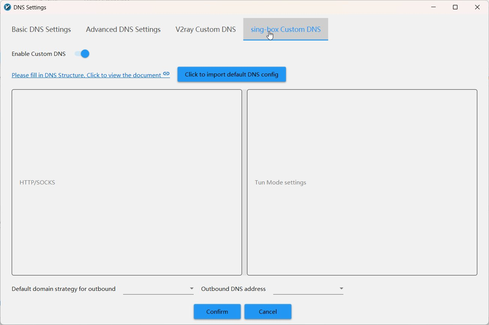
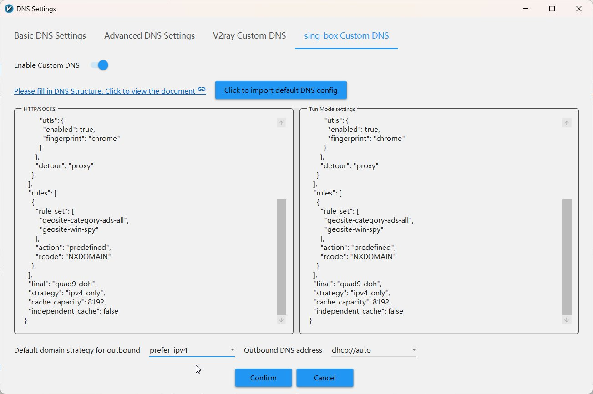

# sing-box Custom DNS

## Step 1. Open sing-box Custom DNS tab

<div class="steps" markdown>

1. In **DNS Settings** window click the **sing-box Custom DNS** tab
2. Enable **Enable Custom DNS** toggle (if not already on)

</div>

<figure>
  
  <figcaption>sing-box Custom DNS with two empty fields</figcaption>
</figure>

## Step 2. Paste configuration into BOTH fields

The tab has two text fields:

- **HTTP/SOCKS** — used when sing-box operates in proxy mode
- **Tun Mode settings** — used when sing-box operates in TUN mode

!!! warning "Paste into both fields"
    The same configuration goes into **both** fields.

??? note "sing-box DNS JSON — click to expand and copy"

    ```json title="sing-box-dns.json"
    --8<-- "configs/v2rayn/sing-box/dns.json"
    ```

## Step 3. Set strategy and DNS address

<div class="steps" markdown>

1. At the bottom, set **Default domain strategy for outbound**: `prefer_ipv4`
2. Set **Outbound DNS address**: `dhcp://auto`
3. Click **Confirm**

</div>

<figure>
  
  <figcaption>Configuration in both fields, strategy and DNS address set</figcaption>
</figure>

---

## Parameter explanations

### DNS server (Quad9 DoH)

<div class="param-card" markdown>
**`server: "9.9.9.9"`** — connects directly by IP. Elegant DNS loop solution: no need to resolve a hostname, so no bootstrap chain required.
</div>

<div class="param-card" markdown>
**`headers: { "Host": "dns.quad9.net" }`** — HTTP Host header. Since we connect by IP, the server needs this to know which service we want.
</div>

<div class="param-card" markdown>
**`tls.server_name`** — SNI for TLS handshake + certificate validation. Ensures the connection is to the real Quad9, not an impostor.
</div>

<div class="param-card" markdown>
**`utls.fingerprint: "chrome"`** — mimics Chrome's TLS fingerprint. Makes DNS traffic indistinguishable from normal browsing for DPI systems.
</div>

<div class="param-card" markdown>
**`detour: "proxy"`** — DNS queries go through the proxy tunnel. ISP sees nothing.
</div>

### DNS rule: block ads and telemetry

<div class="param-card" markdown>
**`rcode: "NXDOMAIN"`** — for ad domains and Windows telemetry, sing-box instantly responds "domain doesn't exist." No real DNS query, no ads, no telemetry.
</div>

---

## Done!

Click **Confirm** in DNS Settings — saves both tabs at once.

Restart connection: ++ctrl+r++

[:material-arrow-right: Verification →](../verification/index.md)
