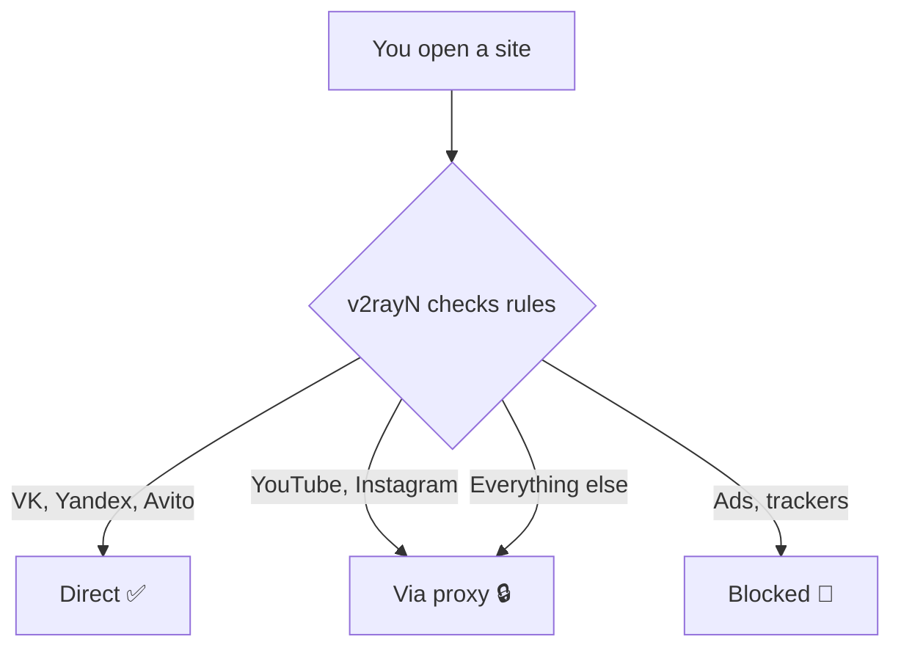

# :material-routes: Routing

Routing is the **most important** part of the setup. It determines:

- which sites go **directly** (no proxy)
- which go **through proxy** (blocked and foreign)
- which are **blocked** (ads, trackers)

---

## How it works (simple explanation)

v2rayN checks each connection **top to bottom** through the rules list.
The first matching rule wins. If nothing matches — the **final rule** fires
(in our case: send through proxy).

!!! warning "Rule order matters!"

    Rules are checked **top to bottom**. If you put "everything via proxy"
    as the first rule — all other rules will be ignored.

---

## Subsections

| Page | What you'll learn |
|---|---|
| [How rules work](how-it-works.md) | What are `outboundTag`, `domain`, `ip`, `geosite` |
| [Step-by-step setup](setup.md) | Where and how to enter rules in v2rayN (with screenshots) |
| [Every rule explained](rules-explained.md) | Why each rule in our set exists |
