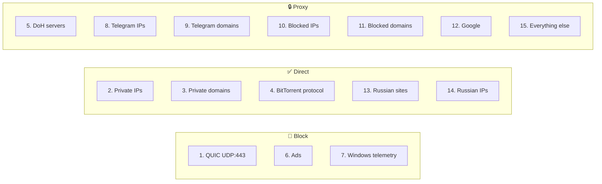
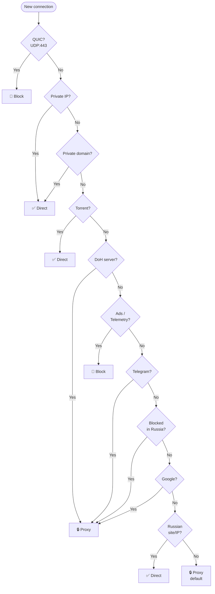

# Every rule explained

Below is a breakdown of **every rule** in our routing set.
Rules are checked **top to bottom** — first match wins.

---

## Overview: all 15 rules at a glance



---

## Rule 1: Block QUIC (UDP:443)

```json
{ "port": "443", "network": "udp", "outboundTag": "block" }
```

<div class="param-card" markdown>
Blocks **QUIC** (HTTP/3) protocol running over UDP port 443. When QUIC is blocked, browsers automatically fall back to regular HTTPS (TCP:443), which proxies cleanly through the tunnel.
</div>

## Rules 2–3: Private networks direct

<div class="param-card" markdown>
**Rule 2** (`geoip:private`): Local IPs (`192.168.x.x`, `10.x.x.x`, `127.0.0.1`) → direct. Your router, NAS, printer, localhost.

**Rule 3** (`geosite:private`): Local domains (`localhost`, `*.local`, `*.lan`) → direct.
</div>

## Rule 4: Torrent direct

<div class="param-card" markdown>
**`protocol: bittorrent`**: BitTorrent protocol from any torrent client → direct. Requires sniffing enabled in v2rayN. BitTorrent creates hundreds of connections — sending through proxy would overload the server.
</div>

## Rule 5: DoH via proxy

<div class="param-card" markdown>
DNS servers (`dns.quad9.net`, `doh.mullvad.net`) → proxy. Even though DoH is encrypted, your ISP can see which DNS server you connect to. Through proxy — ISP sees nothing.
</div>

## Rules 6–7: Block ads and Windows telemetry

<div class="param-card" markdown>
**Rule 6** (`geosite:category-ads-all`): Blocks all known ad domains and trackers. Cleaner, faster browsing.

**Rule 7** (`geosite:win-spy`): Blocks Windows telemetry domains (`vortex.data.microsoft.com`, etc.). Stops data collection at network level.
</div>

## Rules 8–9: Telegram via proxy

<div class="param-card" markdown>
**Rule 8** (`geoip:telegram`): Telegram server IPs → proxy. Covers voice/video calls.

**Rule 9** (`geosite:telegram`): Telegram domains → proxy. Covers web traffic.

Using `geoip:telegram` instead of manual IP ranges means the list auto-updates with geo-file updates.
</div>

## Rules 10–11: Blocked in Russia → proxy

<div class="param-card" markdown>
**Rule 10** — Three IP lists for maximum coverage:

- `geoip:ru-blocked` — official blocked IP registry
- `geoip:ru-blocked-community` — community additions
- `geoip:re-filter` — IPs detected by active monitoring

**Rule 11** (`geosite:ru-blocked-all`) — unified blocked domains list.
</div>

## Rule 12: Google via proxy

<div class="param-card" markdown>
All Google services (Search, YouTube, Gmail, Drive, Maps, Play Store, etc.) → proxy. Ensures all Google subdomains go through proxy even if not in `ru-blocked-all`.
</div>

## Rules 13–14: Russian sites/IPs direct

<div class="param-card" markdown>
**Rule 13** (`geosite:category-ru`): Russian websites (VK, Yandex, Mail.ru, government services, banks, Avito, etc.) → direct.

**Rule 14** (`geoip:ru`): Russian IP ranges → direct.

These rules come **after** blocked-site rules (10–11), so blocked Russian sites still go through proxy.
</div>

## Rule 15: Everything else → proxy (final)

<div class="param-card" markdown>
Any traffic not matching the 14 rules above → proxy. Safe default: if a blocked resource isn't in the lists, it still goes through proxy rather than being blocked directly.
</div>

---

## Full routing flow



---

[:material-arrow-left: How rules work](how-it-works.md) · [:material-arrow-right: DNS Setup →](../dns/index.md)
