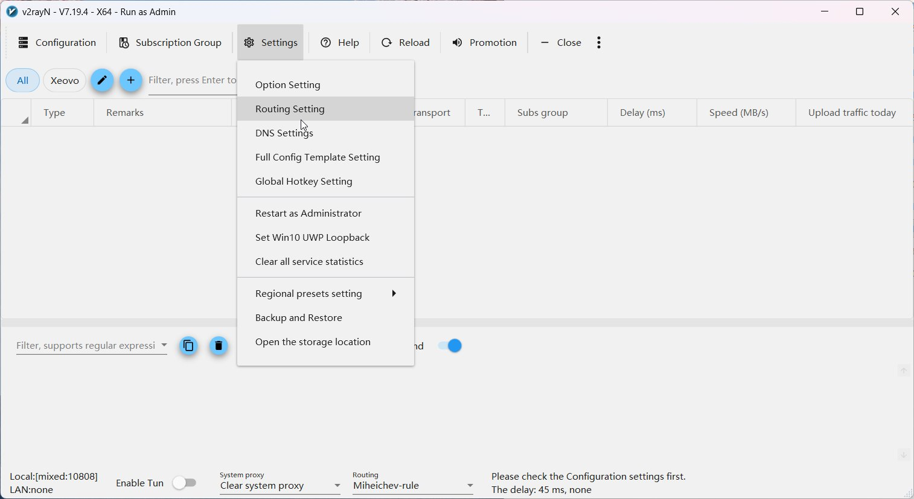
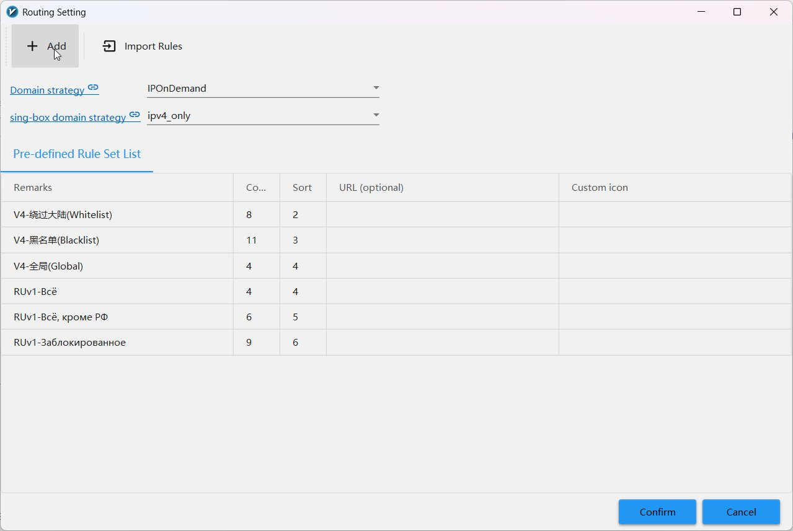
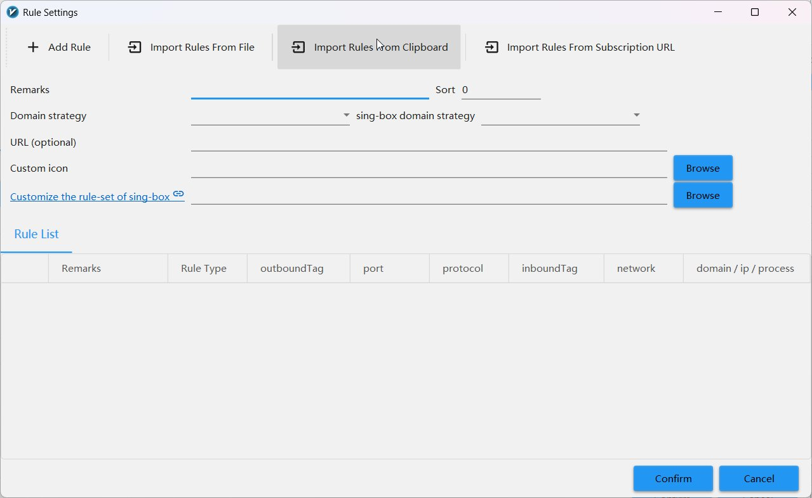
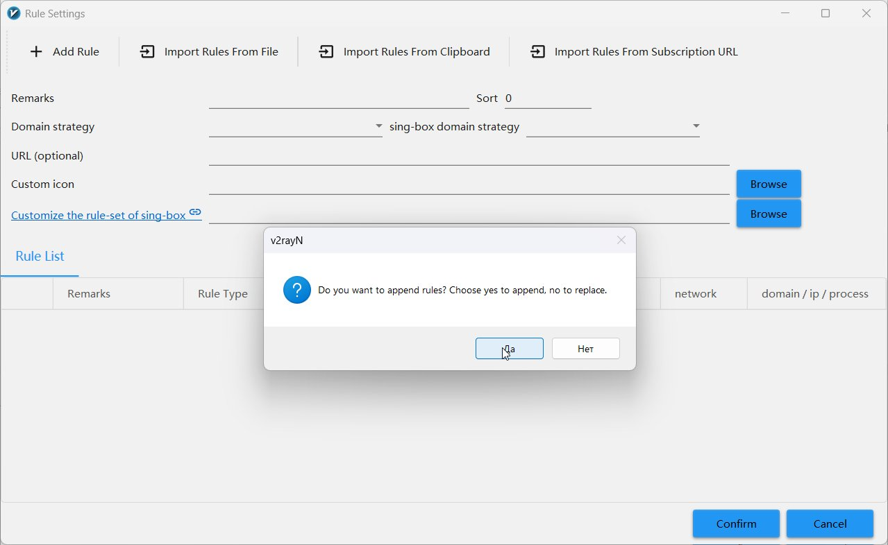
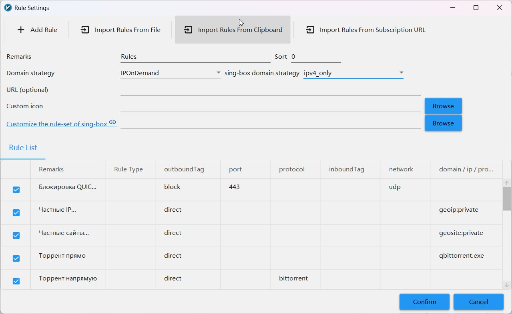
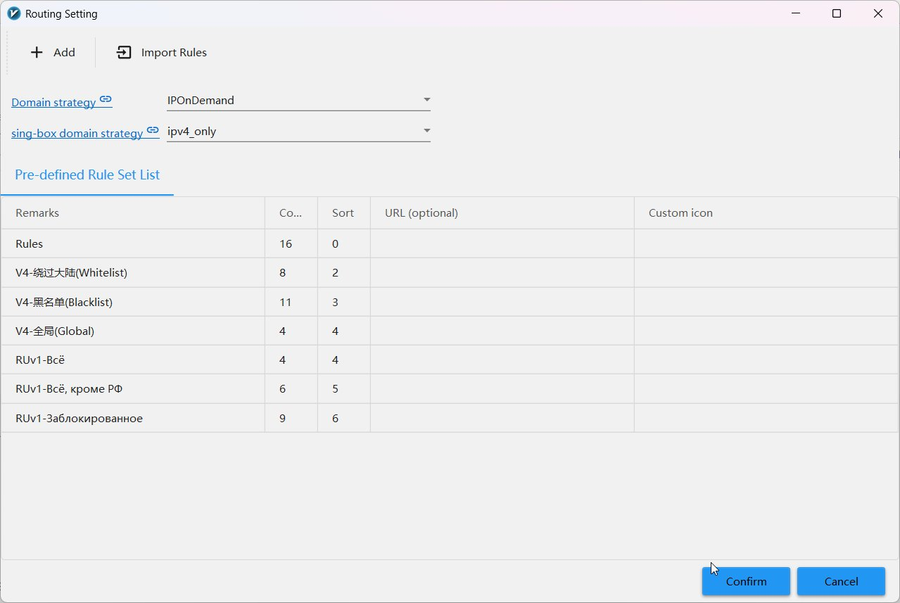

# Routing setup step by step

!!! info "Time: ~5 minutes"

    Below is a step-by-step guide with screenshots. Follow in order.

---

## Step 1. Open routing settings

<div class="steps" markdown>

1. Open **v2rayN**
2. In the top menu click **Settings**
3. Select **Routing Setting**

</div>

<figure>
  
  <figcaption>Settings → Routing Setting</figcaption>
</figure>

---

## Step 2. Click «+ Add»

The **Routing Setting** window opens with a list of existing rule sets.

<div class="steps" markdown>

1. Click the **+ Add** button in the top left corner

</div>

<figure>
  
  <figcaption>Click «+ Add» to create a new rule set</figcaption>
</figure>

---

## Step 3. Copy rules and import from clipboard

The **Rule Settings** window opens. The fastest way is importing from
clipboard.

<div class="steps" markdown>

1. Copy the JSON rules below (click the :material-content-copy: icon in the top
   right of the code block)
2. In Rule Settings click the **Import Rules From Clipboard** tab
3. Click it

</div>

<figure>
  
  <figcaption>Click «Import Rules From Clipboard» — rules will be pasted from clipboard</figcaption>
</figure>

??? note "Routing rules JSON — click to expand and copy"

    ```json title="routing-rules.json"
    --8<-- "configs/v2rayn/xray/routing-rules.json"
    ```

    **Online:** copy the JSON above by clicking :material-content-copy:

    **Locally:** the file is at `configs/v2rayn/xray/routing-rules.json`

---

## Step 4. Confirm import

A dialog appears: «Do you want to append rules?»

<div class="steps" markdown>

1. Creating a **new** rule set — click **Нет / No** (replace)
2. Want to **add** to existing rules — click **Да / Yes** (append)

</div>

<figure>
  
  <figcaption>«Да/Yes» = append to existing, «Нет/No» = replace all rules</figcaption>
</figure>

!!! tip "Recommendation"
If setting up from scratch — click **Нет/No** (replace) for a clean rule set.

---

## Step 5. Verify rules, fill in name and strategies

After import you'll see all rules in the Rule List.

<div class="steps" markdown>

1. Verify rules are displayed (15 rules)
2. In the **Remarks** field enter a name, e.g.: `Rules`
3. Set **Domain strategy**: `IPOnDemand`
4. Set **sing-box domain strategy**: `ipv4_only`
5. Click **Confirm** at the bottom right

</div>

<figure>
  
  <figcaption>Fill in Remarks, select strategies, click Confirm</figcaption>
</figure>

<div class="param-card" markdown>

**Domain strategy: `IPOnDemand`** — Xray resolves domain to IP **only when
needed** for IP rules. Saves DNS queries. Optimal balance of accuracy and
speed.

</div>

<div class="param-card" markdown>

**sing-box domain strategy: `ipv4_only`** — when in TUN mode (sing-box core),
request only IPv4 addresses. IPv6 disabled — fewer leaks, fewer surprises.

</div>

---

## Step 6. Confirm in Routing Setting window

You'll return to the main **Routing Setting** window.

<div class="steps" markdown>

1. Verify your rule set (`Rules`) is in the list
2. Click **Confirm** at the bottom right

</div>

<figure>
  
  <figcaption>«Rules» appears in the list → click Confirm</figcaption>
</figure>

!!! success "Done!"

    Routing is configured. Don't forget to **select** this rule set
    in the main v2rayN window: bottom panel → **Routing** dropdown →
    select your `Rules` set.

---

## Step 7. Activate the rule set

In the main v2rayN window, in the bottom status bar:

<div class="steps" markdown>

1. Find the **Routing** dropdown (bottom right)
2. Select your rule set `Rules`
3. Restart connection: Reload button in the menu

</div>

---

## What's next

Routing is done! Now let's configure secure DNS:

[:material-arrow-right: DNS Setup →](../dns/index.md)
