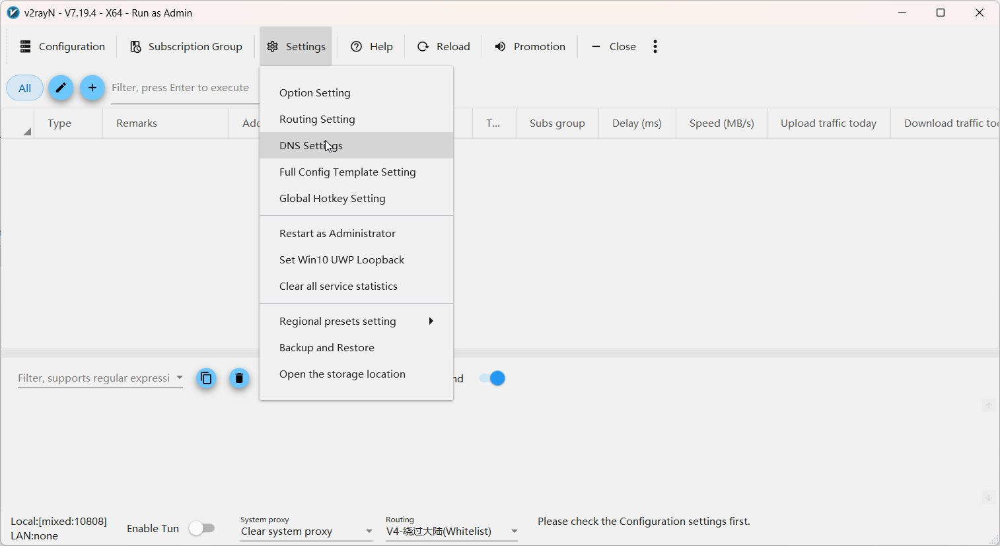

# :material-dns: Настройка DNS

DNS — это «телефонная книга интернета». Когда вы набираете `youtube.com`,
DNS превращает это имя в IP-адрес сервера.

---

## Зачем настраивать DNS отдельно?

!!! danger "Проблема: DNS-утечки"

    По умолчанию DNS-запросы идут **через вашего провайдера** в открытом виде.
    Это значит:

    - :material-eye: Провайдер **видит** все сайты, которые вы посещаете
    - :material-close-circle: Провайдер может **подменить** ответ DNS
      (DNS poisoning) и заблокировать сайт
    - :material-shield-off: Даже с прокси ваши DNS-запросы могут
      «утечь» мимо туннеля

!!! success "Решение: DoH через прокси"

    Мы настроим **DNS over HTTPS (DoH)** — зашифрованные DNS-запросы,
    которые идут **через прокси-туннель**.

    Провайдер не увидит ни содержимое запросов, ни сам факт обращения
    к DNS-серверам.

---

## Как открыть настройки DNS

Все настройки DNS находятся в **одном окне** с вкладками.

1. Откройте **v2rayN**
2. В верхнем меню нажмите **Settings**
3. Выберите **DNS Settings**

<figure>
  
  <figcaption>Settings → DNS Settings</figcaption>
</figure>

Откроется окно **DNS Settings** с четырьмя вкладками:

| Вкладка | Что настраивает |
|---|---|
| Basic DNS Settings | Базовые настройки (не трогаем) |
| Advanced DNS Settings | Продвинутые настройки (не трогаем) |
| **V2ray Custom DNS** | DNS для ядра Xray (режим HTTP/SOCKS прокси) |
| **sing-box Custom DNS** | DNS для ядра sing-box (TUN-режим) |

Мы настроим **обе** вкладки — V2ray Custom DNS и sing-box Custom DNS.

---

## Подразделы

| Страница | Что настраиваем |
|---|---|
| [V2ray Custom DNS (Xray)](xray.md) | Вкладка V2ray Custom DNS — для режима системного прокси |
| [sing-box Custom DNS](sing-box.md) | Вкладка sing-box Custom DNS — для TUN-режима |
| [Почему Quad9 и Mullvad](why-these-providers.md) | Обоснование выбора DNS-провайдеров |

!!! tip "Рекомендация"
    Настройте **обе** вкладки — так при переключении между режимами
    (HTTP/SOCKS ↔ TUN) DNS будет работать корректно в любом случае.
