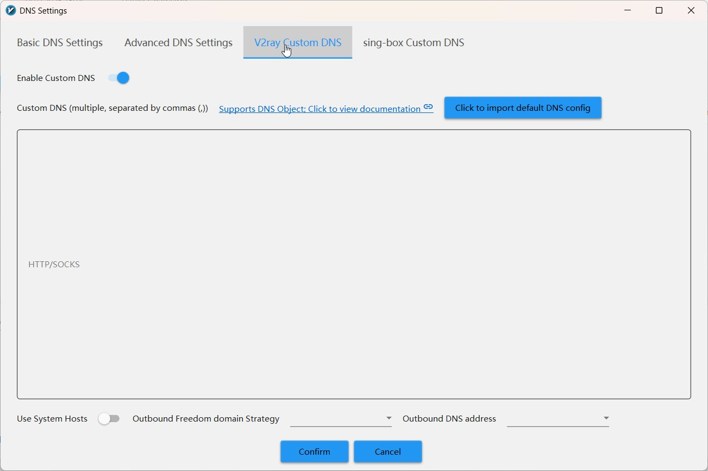
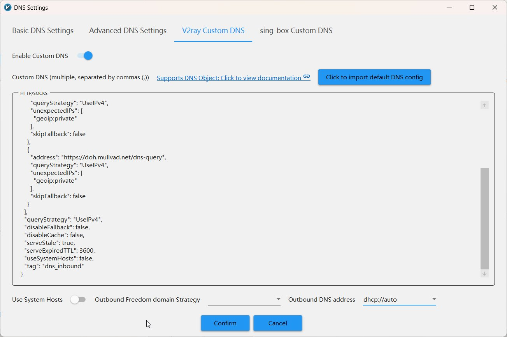

# V2ray Custom DNS (Xray)

---

## Шаг 1. Откройте вкладку V2ray Custom DNS

<div class="steps" markdown>

1. В окне **DNS Settings** нажмите вкладку **V2ray Custom DNS**
2. Включите переключатель **Enable Custom DNS** (если ещё не включён)

</div>

<figure>
  
  <figcaption>Вкладка V2ray Custom DNS с пустым полем HTTP/SOCKS</figcaption>
</figure>

---

## Шаг 2. Вставьте конфигурацию

Скопируйте JSON ниже и вставьте в поле **HTTP/SOCKS**:

??? note "JSON конфигурации Xray DNS — нажмите чтобы развернуть и скопировать"

    ```json title="xray-dns.json"
    --8<-- "configs/v2rayn/xray/dns.json"
    ```

    **Онлайн:** скопируйте JSON выше, нажав :material-content-copy:

    **Локально:** файл находится в `configs/v2rayn/xray/dns.json`

---

## Шаг 3. Укажите Outbound DNS address

<div class="steps" markdown>

1. Внизу окна в поле **Outbound DNS address** выберите: `dhcp://auto`
2. Нажмите **Confirm**

</div>

<figure>
  
  <figcaption>Конфигурация вставлена, Outbound DNS address = dhcp://auto</figcaption>
</figure>

<div class="param-card" markdown>

**`dhcp://auto`** — для исходящего трафика, который идёт **напрямую** (direct),
Xray будет использовать DNS от вашего роутера/провайдера (через DHCP).

**Зачем:** прямой трафик (российские сайты) должен резолвиться через
локальный DNS — это быстрее и не создаёт аномалий. DNS через прокси
используется только для трафика, который идёт через прокси.

</div>

!!! warning "Не нажимайте Confirm пока!"
    Сначала настройте вкладку sing-box Custom DNS (следующая страница),
    а потом нажмите Confirm один раз — сохранятся обе настройки.

---

## Объяснение каждого параметра

### Блок `hosts`

```json
"hosts": {
  "dns.quad9.net": ["9.9.9.9", "149.112.112.112"],
  "doh.mullvad.net": ["194.242.2.2"]
}
```

<div class="param-card" markdown>

**Что делает:** привязывает имена DNS-серверов к их IP-адресам **напрямую**,
без DNS-запроса.

**Зачем:** чтобы разорвать «петлю». Без этого Xray попытался бы
зарезолвить `dns.quad9.net` через… самого себя, и завис бы навечно.

Это **bootstrap** — начальная точка, которая не требует DNS.

</div>

---

### Блок `servers`

```json
{
  "address": "https://dns.quad9.net/dns-query",
  "queryStrategy": "UseIPv4",
  "unexpectedIPs": ["geoip:private"],
  "skipFallback": false
}
```

<div class="param-card" markdown>

**`address`** — URL DNS-сервера. Префикс `https://` означает **DoH**
(DNS over HTTPS) — запросы зашифрованы.

</div>

<div class="param-card" markdown>

**`queryStrategy: "UseIPv4"`** — запрашивать только IPv4-адреса (записи A).
IPv6-записи (AAAA) не запрашиваются.

**Зачем:** IPv6 часто создаёт проблемы с маршрутизацией и может приводить
к утечкам. Если у вас нет явной потребности в IPv6 — безопаснее отключить.

</div>

<div class="param-card" markdown>

**`unexpectedIPs: ["geoip:private"]`** — если DNS-сервер вернул
**приватный IP** (`192.168.x.x`, `10.x.x.x`) в ответе — считать
этот ответ **подозрительным** и попробовать другой сервер.

**Зачем:** легитимные сайты не должны резолвиться в приватные IP.
Если это происходит — скорее всего провайдер подменяет DNS-ответ
(DNS poisoning) или перенаправляет на страницу блокировки.

</div>

<div class="param-card" markdown>

**`skipFallback: false`** — этот сервер **может** использоваться как
резервный (fallback). Если основной не ответит — Xray попробует этот.

</div>

---

### Глобальные настройки

```json
"queryStrategy": "UseIPv4",
"disableFallback": false,
"disableCache": false,
"serveStale": true,
"serveExpiredTTL": 3600,
"useSystemHosts": false,
"tag": "dns_inbound"
```

<div class="param-card" markdown>

**`disableFallback: false`** — **не** отключать fallback. Если Quad9 не
ответит — попробовать Mullvad.

</div>

<div class="param-card" markdown>

**`disableCache: false`** — DNS-кэш **включён**. Повторные запросы к
тому же домену будут мгновенными.

</div>

<div class="param-card" markdown>

**`serveStale: true`** + **`serveExpiredTTL: 3600`** — если DNS-запись
в кэше **просрочена**, Xray всё равно вернёт её (до 3600 секунд = 1 час),
одновременно обновляя в фоне.

**Зачем:** если DNS-сервер временно недоступен — сайты продолжат
открываться из кэша, вместо ошибки «DNS resolution failed».
Это критично для стабильности: кратковременный сбой DNS не парализует
интернет.

</div>

<div class="param-card" markdown>

**`useSystemHosts: false`** — **не** использовать системный файл `hosts`.

**Зачем:** системный `hosts` может быть модифицирован малварью или
содержать нежелательные записи. Безопаснее полагаться только на наши
настройки.

</div>

<div class="param-card" markdown>

**`tag: "dns_inbound"`** — внутреннее имя DNS-модуля для Xray.
Используется в маршрутизации — входящие DNS-запросы помечаются этим тегом.

</div>

---

Теперь настроим вторую вкладку:

[:material-arrow-right: sing-box Custom DNS →](sing-box.md)
