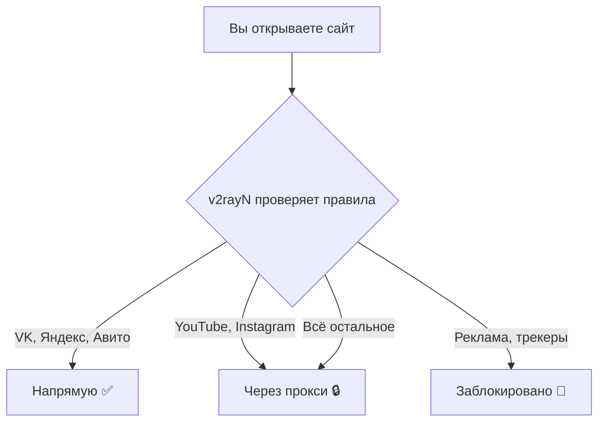

# :material-routes: Маршрутизация (Routing)

Маршрутизация — это **самая важная** часть настройки. Именно она определяет:

- какие сайты пойдут **напрямую** (без прокси)
- какие — **через прокси** (заблокированные и иностранные)
- какие будут **заблокированы** (реклама, трекеры)

---

## Как это работает (простыми словами)

v2rayN проверяет каждое соединение **сверху вниз** по списку правил.
Первое совпавшее правило — выигрывает. Если ничего не совпало — срабатывает
**финальное правило** (у нас: отправить через прокси).

!!! warning "Порядок правил имеет значение!"

    Правила проверяются **сверху вниз**. Если вы поставите «всё через прокси»
    первым правилом — все остальные правила будут проигнорированы.

---

## Подразделы

| Страница | Что узнаете |
|---|---|
| [Как устроены правила](how-it-works.md) | Что такое `outboundTag`, `domain`, `ip`, `geosite` |
| [Настройка шаг за шагом](setup.md) | Где и как ввести правила в v2rayN (со скриншотами) |
| [Каждое правило с объяснением](rules-explained.md) | Зачем нужно каждое правило из нашего набора |
