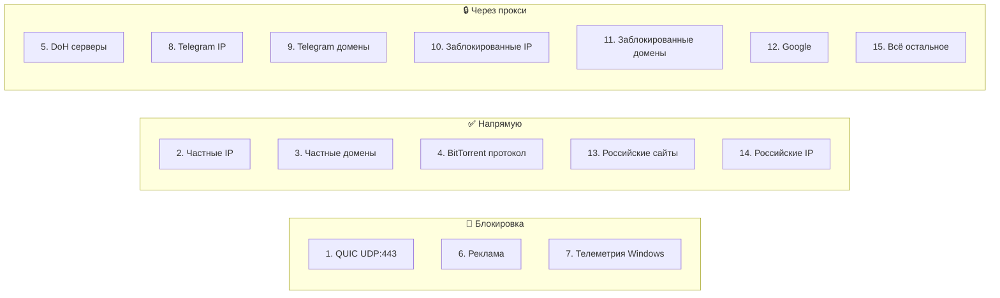
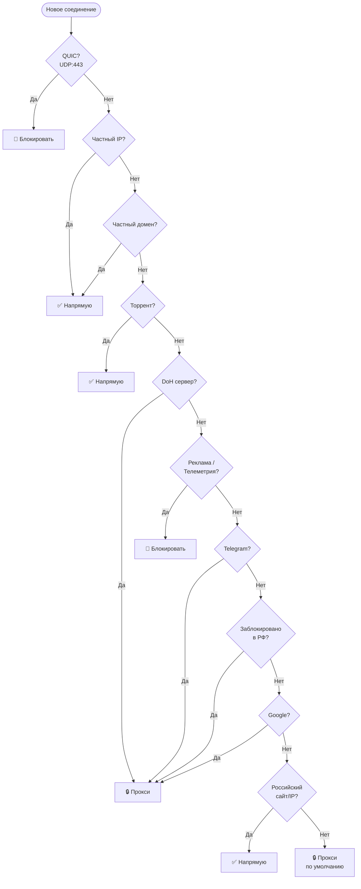

# Каждое правило с объяснением

Ниже разобрано **каждое правило** из нашего набора маршрутизации.
Правила проверяются **сверху вниз** — первое совпавшее выигрывает.

---

## Обзор: все 15 правил одним взглядом



---

## Правило 1: Блокировка QUIC (UDP:443)

```json
{
  "port": "443",
  "network": "udp",
  "outboundTag": "block"
}
```

<div class="param-card" markdown>

**Что делает:** блокирует протокол **QUIC** (HTTP/3), который работает
поверх UDP на порту 443.

**Зачем:** QUIC-соединения сложнее проксировать и анализировать.
Когда QUIC заблокирован, браузер автоматически переключается на обычный
HTTPS (TCP:443), который прекрасно проходит через прокси-туннель.

Без этого правила часть трафика может «утекать» мимо прокси по QUIC,
или соединение будет нестабильным.

</div>

---

## Правило 2: Частные IP напрямую

```json
{
  "outboundTag": "direct",
  "ip": [
    "geoip:private"
  ]
}
```

<div class="param-card" markdown>

**Что делает:** весь трафик к IP-адресам локальной сети (`192.168.x.x`,
`10.x.x.x`, `127.0.0.1`) идёт **напрямую**.

**Зачем:** ваш роутер, NAS, принтер, localhost — это локальные устройства.
Отправка их трафика через зарубежный прокси бессмысленна и сломает
локальные сервисы.

</div>

---

## Правило 3: Частные домены напрямую

```json
{
  "outboundTag": "direct",
  "domain": [
    "geosite:private"
  ]
}
```

<div class="param-card" markdown>

**Что делает:** домены `localhost`, `*.local`, `*.lan`, `*.internal` →
напрямую.

**Зачем:** дополняет правило 2. Некоторые приложения обращаются к
локальным сервисам по имени, а не по IP.

</div>

---

## Правило 4: Торрент напрямую

```json
{
  "outboundTag": "direct",
  "protocol": [
    "bittorrent"
  ]
}
```

<div class="param-card" markdown>

**Что делает:** ловит BitTorrent-протокол от **любого** торрент-клиента
и отправляет **напрямую**.

**Требование:** в v2rayN должен быть включён **sniffing** (определение
протоколов), иначе v2rayN не распознает BitTorrent и трафик уйдёт
через прокси по финальному правилу.

**Зачем напрямую:** BitTorrent создаёт сотни соединений и генерирует
огромный трафик. Через прокси это перегрузит сервер и убьёт скорость
для всех пользователей.

</div>

---

## Правило 5: DoH через прокси

```json
{
  "outboundTag": "proxy",
  "domain": [
    "dns.quad9.net",
    "doh.mullvad.net"
  ]
}
```

<div class="param-card" markdown>

**Что делает:** весь трафик к нашим DNS-серверам (Quad9 и Mullvad) идёт
**через прокси**.

**Зачем:** DNS over HTTPS (DoH) запросы зашифрованы, но ваш провайдер
всё равно видит, **к кому** вы подключаетесь (IP-адрес DNS-сервера).
Через прокси — провайдер не видит даже этого.

</div>

---

## Правило 6: Блокировка рекламы

```json
{
  "outboundTag": "block",
  "domain": [
    "geosite:category-ads-all"
  ]
}
```

<div class="param-card" markdown>

**Что делает:** блокирует соединения ко **всем известным рекламным доменам**
и трекерам.

**Список включает:** Google Ads, Яндекс.Метрика, Facebook Pixel, Mail.ru
трекеры, и тысячи других. Обновляется сообществом.

**Результат:** меньше баннеров, меньше всплывающих окон, быстрее загрузка
страниц, меньше слежки.

</div>

---

## Правило 7: Блокировка телеметрии Windows

```json
{
  "outboundTag": "block",
  "domain": [
    "geosite:win-spy"
  ]
}
```

<div class="param-card" markdown>

**Что делает:** блокирует домены, на которые Windows отправляет **телеметрию**
(данные об использовании, отчёты об ошибках, «улучшение продуктов»).

**Включает:** `vortex.data.microsoft.com`, `settings-win.data.microsoft.com`,
`watson.telemetry.microsoft.com` и десятки других.

**Зачем:** Windows собирает и отправляет в Microsoft значительный объём
данных о вашей активности. Это правило останавливает утечку на сетевом уровне.

</div>

!!! warning "На Linux/macOS это правило безвредно"
    Если вы не на Windows — правило просто не сработает (нет таких доменов
    в трафике). Удалять его не нужно.

---

## Правила 8–9: Telegram через прокси (IP + домены)

```json
{
  "outboundTag": "proxy",
  "ip": [
    "geoip:telegram"
  ]
}
```

```json
{
  "outboundTag": "proxy",
  "domain": [
    "geosite:telegram"
  ]
}
```

<div class="param-card" markdown>

**Правило 8** ловит трафик по **IP-адресам** серверов Telegram
(включая IP для звонков и медиа).

**Правило 9** ловит трафик по **доменам** Telegram
(`telegram.org`, `t.me`, `cdn-telegram.org` и др.).

**Зачем два правила:** Telegram использует и домены, и прямые IP-подключения.
Два правила обеспечивают полное покрытие — текстовые сообщения, звонки, медиа.

**Преимущество `geoip:telegram`** перед ручным списком IP: список обновляется
автоматически при обновлении geo-файлов. Не нужно вручную добавлять новые
диапазоны Telegram.

</div>

---

## Правила 10–11: Заблокированные в РФ ресурсы → прокси

```json
{
  "outboundTag": "proxy",
  "ip": [
    "geoip:ru-blocked",
    "geoip:ru-blocked-community",
    "geoip:re-filter"
  ]
}
```

```json
{
  "outboundTag": "proxy",
  "domain": [
    "geosite:ru-blocked-all"
  ]
}
```

<div class="param-card" markdown>

**Правило 10** — три списка IP заблокированных ресурсов:

- `geoip:ru-blocked` — официальный реестр заблокированных IP
- `geoip:ru-blocked-community` — дополнения от сообщества (ресурсы,
  которые блокируются на практике, но не в реестре)
- `geoip:re-filter` — IP, определённые проектом
  [re:filter](https://github.com/1andrevich/Re-filter-lists) через
  активный мониторинг блокировок

**Правило 11** — `geosite:ru-blocked-all` — **объединённый** список
заблокированных доменов (шире, чем просто `ru-blocked`).

**Зачем три IP-списка:** ни один список не является полным. Роскомнадзор
блокирует ресурсы и по реестру, и «по факту» (ТСПУ). Три источника
дают максимальное покрытие.

</div>

---

## Правило 12: Google через прокси

```json
{
  "outboundTag": "proxy",
  "domain": [
    "geosite:google"
  ]
}
```

<div class="param-card" markdown>

**Что делает:** весь трафик к сервисам Google (Search, YouTube, Gmail,
Google Drive, Maps, Play Store и т.д.) идёт **через прокси**.

**Зачем:** Google-сервисы в России работают с ограничениями, замедлениями,
а некоторые (YouTube) заблокированы. Отдельное правило гарантирует,
что **все** поддомены Google уходят через прокси, даже если они не попали
в `geosite:ru-blocked-all`.

</div>

---

## Правило 13: Российские сайты напрямую

```json
{
  "outboundTag": "direct",
  "domain": [
    "geosite:category-ru"
  ]
}
```

<div class="param-card" markdown>

**Что делает:** трафик к **российским сайтам** (VK, Яндекс, Mail.ru,
Госуслуги, Сбербанк, Авито и тысячи других) идёт **напрямую**.

**`geosite:category-ru`** — это широкий список всех доменов, относящихся
к российскому сегменту интернета.

**Зачем:** российские сайты:

- Работают **быстрее** при прямом подключении
- Некоторые **блокируют** зарубежные IP (банки, госсервисы, Авито)
- Нет смысла гонять этот трафик через зарубежный прокси

**Примечание в Remarks `Актуально при CDN за пределами РФ`:** это правило
особенно важно, когда ваш прокси-сервер за рубежом — без него российские
сайты пойдут через прокси и могут не работать.

</div>

!!! info "Порядок правил важен"
    Это правило стоит **после** правил заблокированных сайтов (10–11).
    Поэтому если сайт одновременно и российский, и заблокированный —
    он пойдёт через прокси (правило 11 сработает раньше).

---

## Правило 14: Российские IP напрямую

```json
{
  "outboundTag": "direct",
  "ip": [
    "geoip:ru"
  ]
}
```

<div class="param-card" markdown>

**Что делает:** трафик к **IP-адресам, принадлежащим российским сетям**
(AS), идёт напрямую.

**Зачем:** дополняет правило 13. Если приложение обращается к российскому
серверу напрямую по IP (без DNS) — это правило его поймает.

</div>

---

## Правило 15: Всё остальное → прокси (финальное)

```json
{
  "port": "0-65535",
  "outboundTag": "proxy"
}
```

<div class="param-card" markdown>

**Что делает:** любой трафик, который **не совпал** ни с одним из
предыдущих 14 правил, отправляется **через прокси**.

**Зачем:** безопасный подход. Если какой-то заблокированный ресурс
не попал в списки — он всё равно пойдёт через прокси (а не напрямую,
где будет заблокирован).

**Альтернатива:** можно поставить `direct` — тогда неизвестный трафик
пойдёт напрямую. Это быстрее, но менее безопасно (заблокированные
сайты вне списков не откроются).

</div>

---

## Полная схема маршрутизации



---

[:material-arrow-left: Как устроены правила](how-it-works.md) · [:material-arrow-right: Настройка DNS →](../dns/index.md)
